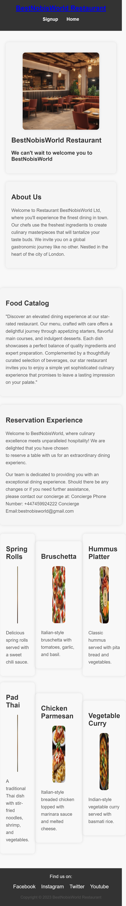
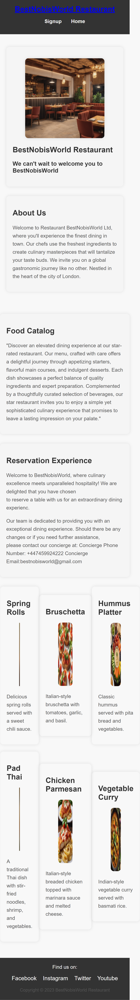
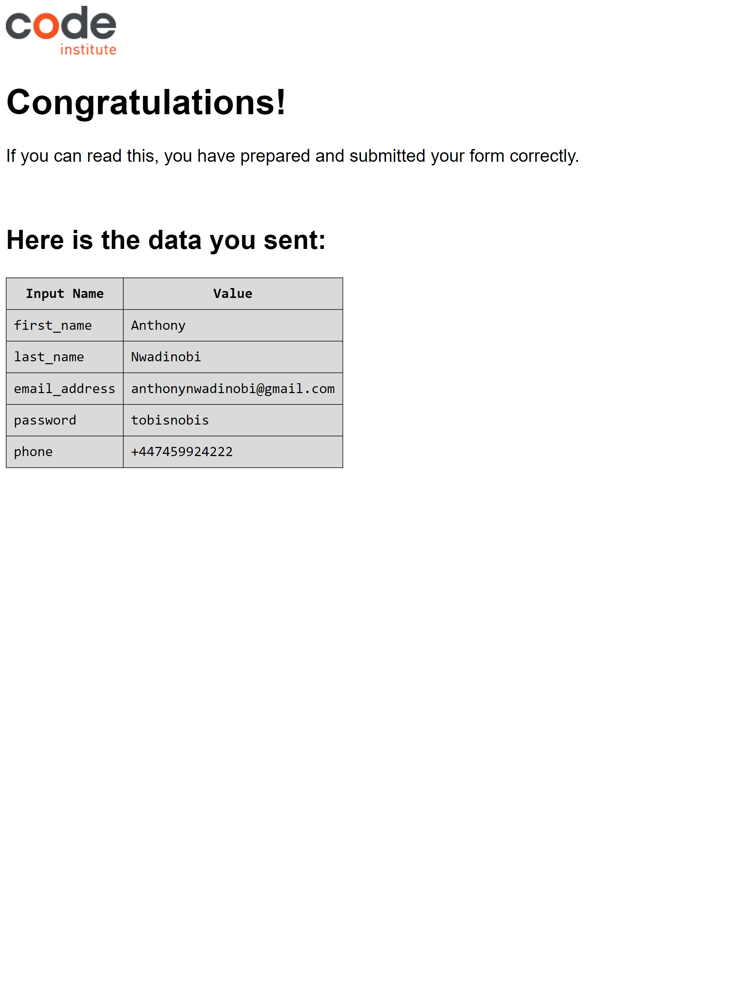
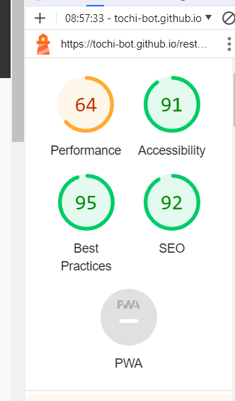

# BestNobisWorld Restaurant Website

Welcome to the README file for the BestNobisWorld Restaurant Website. This document provides an overview of the website's structure, features, and instructions for developers or contributors.

## Table of Contents

- Introduction: #Introduction
- Features: #features
- Folder Structure: (folder-structure)

## Introduction

The BestNobisWorld Restaurant Website was designed to provide an immersive online experience for users, offering information about the restaurant's menu, reservations, and sign up. The website aims to  engage visitors or users in exploring what makes BestNobisWorld exceptional.

## Features

1. **Mobile Responsiveness:** The website is optimized for a seamless experience across various devices, ensuring accessibility and functionality on desktops, tablets, and smartphones.

2. **Intuitive home and sig-up Navigations:** A user-friendly interface with a well-organized navigation menu facilitates easy access to essential information.

3 **Visually Appealing Design:** The website showcases high-quality images that capture the restaurant's interior, dishes, and  delivering a visually appealing and immersive experience.

.

4. **Menu Showcase:** The menu section features enticing visuals, detailed dish descriptions, and interactive elements to enhance the presentation of the website innovative offerings.

7. **Contact Information and Location:** Clear and prominent display of contact information, including phone numbers, email addresses.

8. **Social Media Integration:** Users can connect with the restaurant on various social media platforms

## ScreenShots of how the website look like on different devices
How my website appear's on ipad Pro

How my website appear's on Iphone 14 Pro

How my website appear's on Samsung Galaxy

How my website appear's on code Institute formdump

## Folder Structure

##Testing Validation
.HTML
Some errors were returned when passsing through the official W3C HTML validator.
.CSS
No errors were found when passing through W3C CSS validator
## Accessibility Score

- **css:** Contains stylesheets for styling the website.
- **images:** Stores high-quality images used throughout the website.
- **index.html:** The main HTML file that serves as the entry point for the website.
## challenges Faced 
Testing and Debugging: Thoroughly testing and debugging code to identify and fix issues was time-consuming , difficult but crucial. Learning different testing methodologies and using debugging tools wasn't easy but was part of the development process.
  Designing a  respnsive website that looks good and functions well on different devices and screen sizes was very challenging
  Code anywhere IDE was very slow loading, there by placing me on a time bomb.
  
